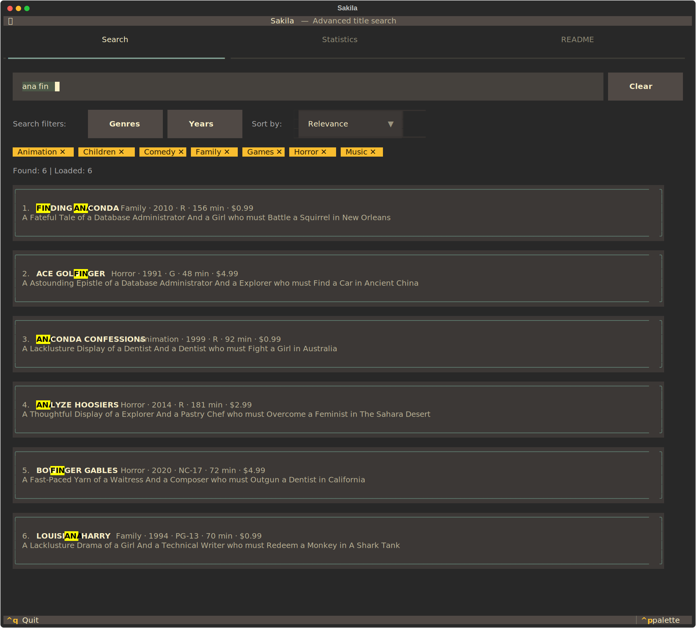
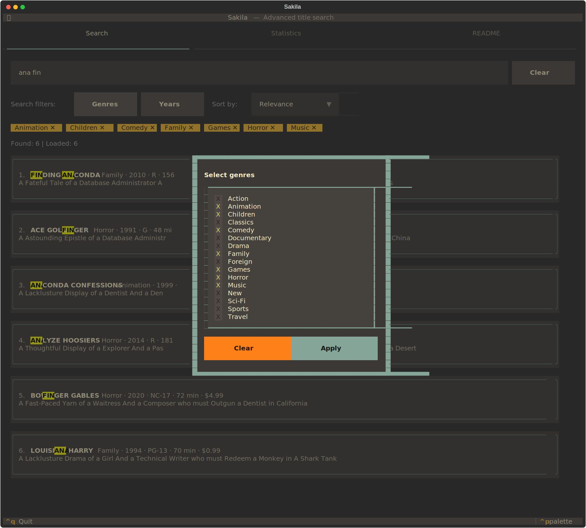
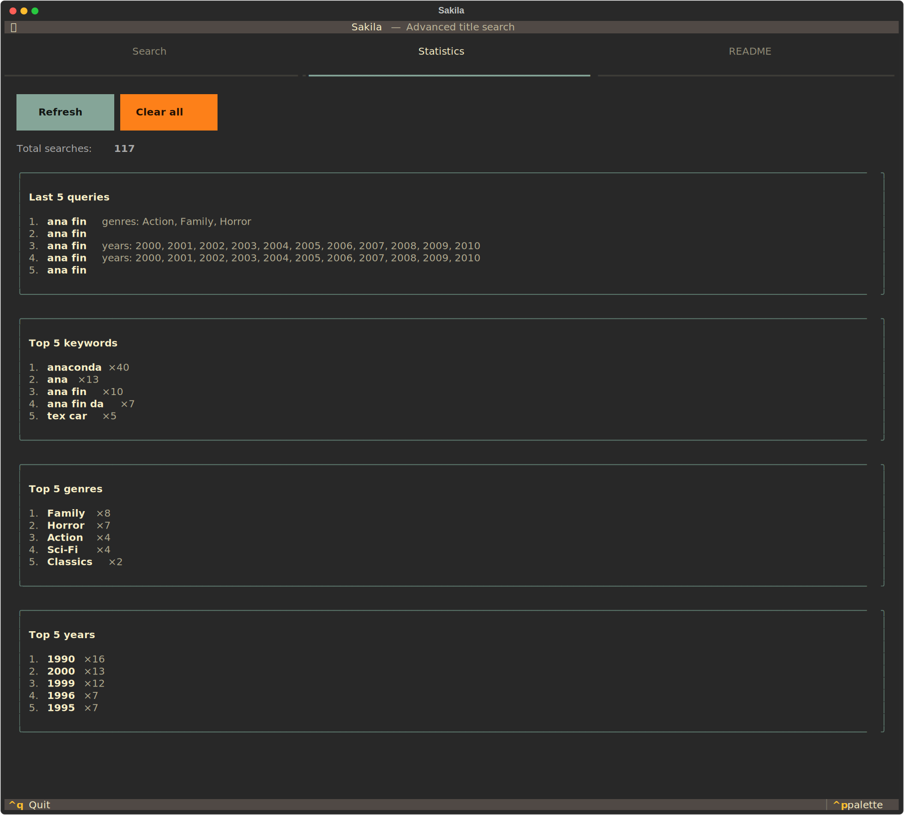
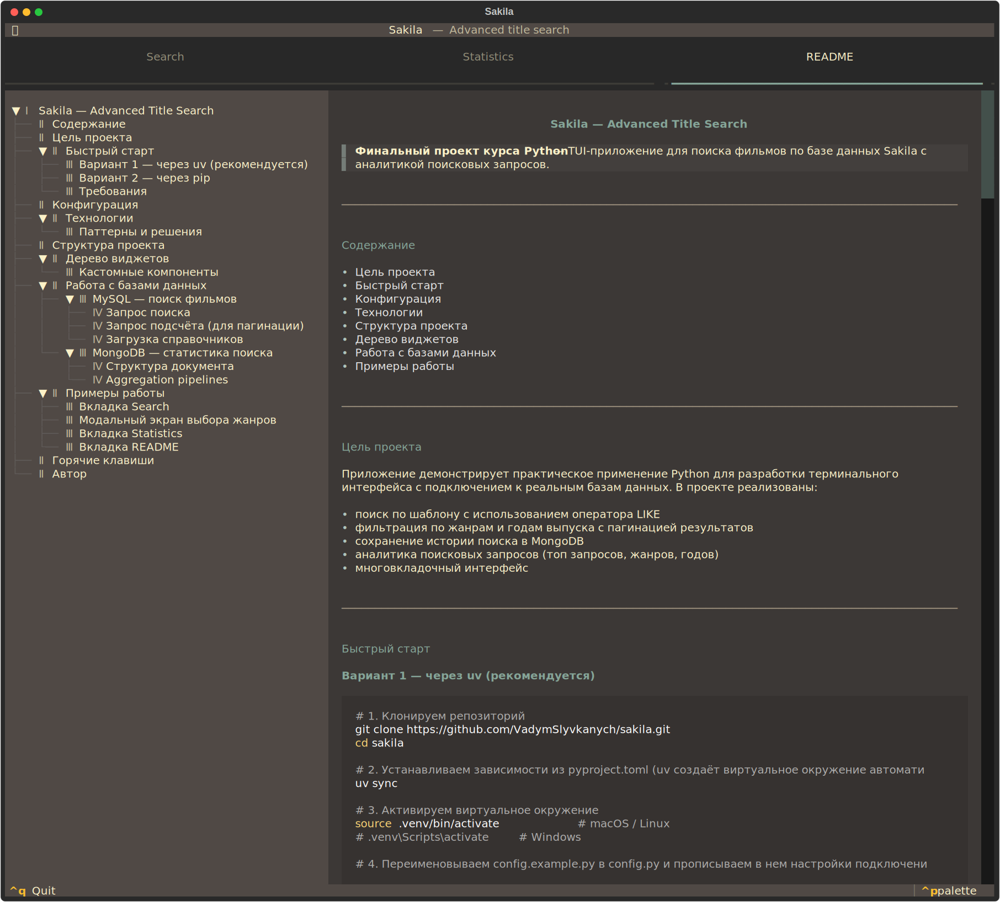

# Sakila — Advanced Title Search

> **Финальный проект курса Python** — TUI-приложение для поиска фильмов по базе данных Sakila с аналитикой поисковых запросов.

---

## Содержание

- [Цель проекта](#цель-проекта)
- [Быстрый старт](#быстрый-старт)
- [Конфигурация](#конфигурация)
- [Технологии](#технологии)
- [Структура проекта](#структура-проекта)
- [Дерево виджетов](#дерево-виджетов)
- [Работа с базами данных](#работа-с-базами-данных)
- [Примеры работы](#примеры-работы)

---

## Цель проекта

Приложение демонстрирует практическое применение Python для разработки терминального интерфейса с подключением к реальным базам данных. В проекте реализованы:

- поиск по шаблону с использованием оператора LIKE
- фильтрация по жанрам и годам выпуска с пагинацией результатов
- сохранение истории поиска в MongoDB
- аналитика поисковых запросов (топ запросов, жанров, годов)
- многовкладочный интерфейс

---

## Быстрый старт

### Вариант 1 — через uv (рекомендуется)

```bash
# 1. Клонируем репозиторий
git clone https://github.com/VadymSlyvkanych/sakila.git
cd sakila

# 2. Устанавливаем зависимости из pyproject.toml (uv создаёт виртуальное окружение автоматически)
uv sync

# 3. Активируем виртуальное окружение
source .venv/bin/activate        # macOS / Linux
# .venv\Scripts\activate         # Windows

# 4. Переименовываем config.example.py в config.py и прописываем в нем настройки подключения к БД

# 5. Запускаем приложение
uv run sakila.py
```

### Вариант 2 — через pip

```bash
# 1. Клонируем репозиторий
git clone https://github.com/VadymSlyvkanych/sakila.git
cd sakila

# 2. Создаём и активируем виртуальное окружение
python -m venv .venv
source .venv/bin/activate        # macOS / Linux
# .venv\Scripts\activate         # Windows

# 3. Устанавливаем зависимости
pip install textual pymysql pymongo

# 4. Переименовываем config.example.py в config.py и прописываем в нем настройки подключения к БД

# 5. Запускаем приложение
python sakila.py
```

### Требования

| Компонент | Версия |
|-----------|--------|
| Python    | 3.10+  |
| Textual   | 8.x    |
| pymysql   | любая  |
| pymongo   | любая  |

---

## Конфигурация

Все настройки подключений находятся в файле **`config.py`**.  
Перед запуском замените значения на свои:

```python
# config.py

# --- MySQL ---
sakila_db = MySQLDB(
    host="your-mysql-host",       # адрес сервера MySQL
    user="your-user",             # имя пользователя
    password="your-password",     # пароль
    database="your-db",           # имя базы данных
)

# --- MongoDB ---
MONGO_HOST = "your-mongo-host"    # адрес сервера MongoDB
MONGO_USER = "your-user"          # имя пользователя
MONGO_PASSWORD = "your-password"  # пароль
MONGO_AUTH_DB = "your-auth-db"    # имя базы данных аутентификации (где хранятся учетные данные пользователя)
MONGO_DB = "your-db"              # имя базы данных
MONGO_COLLECTION = "your-collection-name" # имя коллекции
```

---

## Технологии

| Технология | Роль в проекте |
|------------|----------------|
| [Textual](https://textual.textualize.io/) | TUI-фреймворк: виджеты, экраны, CSS-стили, реактивность |
| MySQL + pymysql | Основная база данных Sakila: фильмы, жанры, годы |
| MongoDB + pymongo | Хранение и аналитика поисковых запросов |
| Python dataclasses | Иммутабельная модель данных `Filters` (frozen=True) |
| Python threading | Фоновые запросы к БД через `@work(thread=True)` |

### Паттерны и решения

**Singleton для подключения к БД** — класс `Database` в `db.py` реализует паттерн Singleton: повторный вызов `MySQLDB(**config)` с теми же параметрами возвращает уже существующий объект, а не создаёт новое соединение. Singleton здесь гарантирует, что для каждой уникальной конфигурации БД в приложении будет только один объект и одно соединение, что предотвращает избыточное потребление ресурсов и обеспечивает согласованность транзакций.

**Иммутабельные фильтры** — `Filters` объявлен как `@dataclass(frozen=True)`. При изменении фильтров создаётся новый объект через `dc_replace()`. Это делает безопасной передачу фильтров в фоновый поток: поток держит ссылку на старый объект который никто не может изменить.

**Retry при потере соединения** — если MySQL-соединение разрывается по таймауту, `db.py` обнуляет `self.conn = None`. При следующем запросе соединение восстанавливается автоматически. Дополнительно в `_do_search` реализованы 2 попытки с паузой 0.5с между ними на случай гонки воркеров.

---

## Структура проекта

```
sakila/
│
├── sakila.py      # Точка входа. Класс SakilaApp — главный экран приложения
├── config.py      # Подключения к MySQL и MongoDB, константы (PAGE_SIZE и др.)
├── models.py      # Класс Filters и функция highlight_terms
├── mongo.py       # Работа с MongoDB: save_search(), get_stats(), clear_all()
├── widgets.py     # Виджеты: FilterTag, FilmCard, LoadMoreButton
├── modals.py      # Модальные экраны: GenresModal, YearsModal
├── styles.tcss    # CSS-стили приложения (Textual CSS)
├── db.py          # Универсальный модуль БД (MySQL, SQLite, PostgreSQL)
└── README.md      # Этот файл
```

---

## Дерево виджетов

```
SakilaApp
├── Header
├── TabbedContent
│   ├── TabPane "Search"  (#tab__search)
│   │   └── Vertical (#main)
│   │       ├── Horizontal (#search__row)
│   │       │   ├── Input (#search__input)          — строка поиска
│   │       │   └── Button "Clear" (#clear__input)  — очистка строки
│   │       ├── Horizontal (#controls__row)
│   │       │   ├── Static "Search filters:"        — подпись
│   │       │   ├── Button "Genres" (#open__genres) — открывает GenresModal
│   │       │   ├── Button "Years" (#open__years)   — открывает YearsModal
│   │       │   ├── Static "Sort by:"               — подпись
│   │       │   └── Select (#sort__select)          — сортировка результатов
│   │       ├── Vertical (#active__filters)         — панель тегов фильтров
│   │       │   └── Horizontal (.tags__row)         — строка тегов (динамически)
│   │       │       └── FilterTag                   — тег жанра или года (×N)
│   │       ├── Static (#status)                    — "Found: X | Loaded: Y"
│   │       └── VerticalScroll (#search__results)   — список результатов
│   │           ├── FilmCard                        — карточка фильма (динамически)
│   │           └── LoadMoreButton                  — дозагрузка (если есть ещё)
│   │
│   ├── TabPane "Statistics"  (#tab__statistics)
│   │   └── VerticalScroll (#stats__container)
│   │       ├── Horizontal (#stats__buttons)
│   │       │   ├── Button "Refresh"               — обновить статистику
│   │       │   └── Button "Clear all"             — удалить всю статистику
│   │       ├── Static (#stats__total)             — общее кол-во запросов
│   │       ├── Vertical (.stats__section)         — Последние 5 запросов
│   │       ├── Vertical (.stats__section)         — Топ 5 ключевых слов
│   │       ├── Vertical (.stats__section)         — Топ 5 жанров
│   │       └── Vertical (.stats__section)         — Топ 5 годов
│   │
│   └── TabPane "README"  (#tab__readme)
│       └── MarkdownViewer                         — отображение README.md
│
├── GenresModal  (ModalScreen, поверх основного экрана)
│   └── Vertical (#modal__container)
│       ├── Label "Select genres"
│       ├── SelectionList (#modal__list)
│       └── Vertical (.modal__footer)
│           └── Horizontal
│               ├── Button "Clear"
│               └── Button "Apply"
│
├── YearsModal  (ModalScreen, поверх основного экрана)
│   └── Vertical (#modal__container)
│       ├── Label "Select years"
│       ├── SelectionList (#modal__list)
│       └── Vertical (.modal__footer)
│           ├── Button "Fill gaps"
│           └── Horizontal
│               ├── Button "Clear"
│               └── Button "Apply"
│
└── Footer
```

### Кастомные компоненты

**`FilterTag`** — кликабельный тег активного фильтра. При клике постит сообщение `FilterTag.Removed` которое `SakilaApp` перехватывает и удаляет соответствующий фильтр.

**`FilmCard`** — карточка фильма. Создаётся динамически для каждого результата поиска. Подсвечивает вхождения поискового запроса в названии через Rich-разметку.

**`LoadMoreButton`** — появляется в конце списка результатов если загружено меньше чем найдено. После нажатия удаляется и появляется снова после загрузки следующей страницы.

**`GenresModal` / `YearsModal`** — модальные экраны поверх основного. Блокируют ввод пока открыты. Возвращают результат через `dismiss(value)` в callback переданный в `push_screen()`.

---

## Работа с базами данных

### MySQL — поиск фильмов

Таблицы Sakila задействованные в запросах:

| Таблица | Поля | Назначение |
|---------|------|-----------|
| `film` | `film_id, title, description, release_year, rating, length, rental_rate` | Основная таблица фильмов |
| `film_category` | `film_id, category_id` | Связь фильм ↔ жанр |
| `category` | `category_id, name` | Справочник жанров |

#### Запрос поиска

Приложение формирует динамический SQL в зависимости от заполненных фильтров:

```sql
-- Пример: поиск "bat for" в жанре Action за 1990-е, сортировка по релевантности
SELECT
  f.film_id,
  f.title,
  f.description,
  f.release_year,
  f.rating,
  f.length,
  f.rental_rate,
  COALESCE(
    (
      SELECT GROUP_CONCAT(c.name ORDER BY c.name SEPARATOR ', ')
      FROM film_category fc
      JOIN category c ON c.category_id = fc.category_id
      WHERE fc.film_id = f.film_id
    ),
    ''
  ) AS category
  , ((f.title LIKE 'bat') + (f.title LIKE 'for')) AS relevance
FROM film f
WHERE 
  ((f.title LIKE 'bat') OR (f.title LIKE 'for')) 
  AND EXISTS (
    SELECT 1 
    FROM film_category fc2 
    JOIN category c2 ON c2.category_id = fc2.category_id 
    WHERE 
      fc2.film_id = f.film_id 
      AND c2.name IN ('Action')
  ) 
  AND f.release_year IN (1990, 1991, 1992, 1993, 1994, 1995, 1996, 1997, 1998, 1999)
ORDER BY relevance DESC, f.title
LIMIT 10 OFFSET 0;
```

#### Запрос подсчёта (для пагинации)

```sql
-- Выполняется перед основным запросом чтобы знать общее количество
SELECT COUNT(DISTINCT f.film_id) AS total
FROM film f
WHERE 
  ((f.title LIKE 'bat') OR (f.title LIKE 'for')) 
  AND EXISTS (
    SELECT 1 
    FROM film_category fc2 
    JOIN category c2 ON c2.category_id = fc2.category_id 
    WHERE 
      fc2.film_id = f.film_id 
      AND c2.name IN ('Action')
  ) 
  AND f.release_year IN (1990, 1991, 1992, 1993, 1994, 1995, 1996, 1997, 1998, 1999);
```

#### Загрузка справочников

```sql
-- Жанры (при старте приложения)
SELECT name FROM category ORDER BY name;

-- Годы выпуска (при старте приложения)
SELECT DISTINCT release_year FROM film ORDER BY release_year;
```

---

### MongoDB — статистика поиска

#### Структура документа

Каждый поисковый запрос сохраняется как документ:

```json
{
  "_id":        "ObjectId(...)",
  "query":      "batman",
  "genres":     ["Action", "Drama"],
  "years":      [1990, 1991, 1992],
  "created_at": "2026-03-20T14:30:00Z"
}
```

#### Aggregation pipelines

**5 последних уникальных запросов:**
```python
recent = list(searches_col.aggregate([
    {"$sort": {"created_at": -1}},
    {
        "$group": {
            "_id": {
                "query": "$query",
                "genres": "$genres",
                "years": "$years"
            },
            "query": {"$first": "$query"},
            "genres": {"$first": "$genres"},
            "years": {"$first": "$years"},
            "created_at": {"$first": "$created_at"}
        }
    },
    {"$sort": {"created_at": -1}},
    {"$limit": 5}
]))
```

**Топ-5 запросов по ключевым словам:**

```python
db.collection.aggregate([
  { $match:  { query: { $ne: "" } } },  // исключаем пустые (когда запрос был только по жанрам и/или годам)
  { $group:  { _id: "$query", count: { $sum: 1 } } },
  { $sort:   { count: -1 } },
  { $limit:  5 }
])
```

**Топ-5 жанров** (`$unwind` разворачивает массив в отдельные документы):

```python
db.collection.aggregate([
  { $unwind: "$genres" },               // ["Action","Drama"] → 2 документа
  { $group:  { _id: "$genres", count: { $sum: 1 } } },
  { $sort:   { count: -1 } },
  { $limit:  5 }
])
```

**Топ-5 годов** (аналогично жанрам):

```python
db.collection.aggregate([
  { $unwind: "$years" },
  { $group:  { _id: "$years", count: { $sum: 1 } } },
  { $sort:   { count: -1 } },
  { $limit:  5 }
])
```

---

## Примеры работы

### Вкладка Search



### Модальный экран выбора жанров



### Вкладка Statistics



### Вкладка README



---

## Горячие клавиши

| Клавиша | Действие |
|---------|----------|
| `Ctrl+Q` | Выйти из приложения |

---

## Автор

**Vadym Slyvkanych** — финальный проект курса Python, группа 101025-ptm, апрель 2026.
